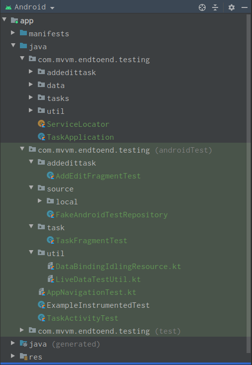

# Android-Kotlin-MVVM-EndToEnd-Testing(Instrument Testing)
Android-Kotlin-MVVM-EndToEnd-Testing

<strong>Android</strong> <strong>Testing Topics</strong>:

<ul>
<li style="font-weight: 400;">Coroutines, including view model, scoped coroutines.</li>
<li style="font-weight: 400;">Room.</li>
<li style="font-weight: 400;">Databinding.</li>
<li style="font-weight: 400;">Dependency Injection and Test Doubles.</li>
<li style="font-weight: 400;">Testing code with coroutines.</li>
<li style="font-weight: 400;">Testing Room.</li>
<li style="font-weight: 400;">Espresso Idling Resource.</li>
<li style="font-weight: 400;">End to End testing with Data Binding.</li>
</ul>

You'll learn about the following libraries and code concepts:

<ul>
<li style="font-weight: 400;"><a style="color: #0000ff;" href="https://junit.org/junit4/">JUnit4</a></li>
<li style="font-weight: 400;"><a style="color: #0000ff;" href="http://hamcrest.org/">Hamcrest</a></li>
<li style="font-weight: 400;"><a style="color: #0000ff;" href="https://developer.android.com/training/testing/set-up-project">AndroidX Test Library</a></li>
<li style="font-weight: 400;"><a style="color: #0000ff;" href="https://developer.android.com/reference/android/arch/core/executor/testing/package-summary">AndroidX Architecture Components Core Test Library</a></li>
<li style="font-weight: 400;"><a style="color: #0000ff;" href="https://developer.android.com/training/testing/espresso">Espresso</a></li>
<li style="font-weight: 400;"><a style="color: #0000ff;" href="https://site.mockito.org/">Mockito</a></li>
<li style="font-weight: 400;"><a style="color: #0000ff;" href="https://kotlin.github.io/kotlinx.coroutines/kotlinx-coroutines-core/kotlinx.coroutines/run-blocking.html">runBlocking</a> and <a style="color: #0000ff;" href="https://kotlin.github.io/kotlinx.coroutines/kotlinx-coroutines-test/kotlinx.coroutines.test/run-blocking-test.html">runBlockingTest</a></li>
<li style="font-weight: 400;"><a style="color: #0000ff;" href="https://kotlin.github.io/kotlinx.coroutines/kotlinx-coroutines-test/kotlinx.coroutines.test/-test-coroutine-dispatcher/">TestCoroutineDispatcher</a></li>
<li style="font-weight: 400;"><a style="color: #0000ff;" href="https://kotlin.github.io/kotlinx.coroutines/kotlinx-coroutines-test/kotlinx.coroutines.test/-delay-controller/pause-dispatcher.html">pauseDispatcher</a> and <a style="color: #0000ff;" href="https://kotlin.github.io/kotlinx.coroutines/kotlinx-coroutines-test/kotlinx.coroutines.test/-delay-controller/resume-dispatcher.html">resumeDispatcher</a></li>
<li style="font-weight: 400;"><a style="color: #0000ff;" href="https://developer.android.com/reference/androidx/room/Room.html#inMemoryDatabaseBuilder(android.content.Context,%20java.lang.Class%3CT%3E)">inMemoryDatabaseBuilder</a></li>
<li style="font-weight: 400;"><a style="color: #0000ff;" href="https://developer.android.com/reference/androidx/test/espresso/IdlingResource.html">IdlingResource</a></li>
</ul>

You should be familiar with:

<ul>
<li style="font-weight: 400;">The Kotlin programming language, including <a href="https://developer.android.com/kotlin/coroutines">Kotlin coroutines</a> and their interaction with <a style="color: #0000ff;" href="https://developer.android.com/topic/libraries/architecture/coroutines">Android Jetpack components</a>.</li>
<li style="font-weight: 400;">The following core Android Jetpack libraries: <a style="color: #0000ff;" href="https://developer.android.com/topic/libraries/architecture/viewmodel">ViewModel</a>, <a style="color: #0000ff;" href="https://developer.android.com/topic/libraries/architecture/livedata">LiveData</a>, <a style="color: #0000ff;" href="https://developer.android.com/guide/navigation">Navigation Component</a>, and <a style="color: #0000ff;" href="https://developer.android.com/topic/libraries/data-binding">Data Binding</a>.</li>
</ul>

<strong>App overview and Instrument testing in Device:</strong>

<table style="margin-left: auto; margin-right: auto;">
<tbody>
<tr>
<td></td>
<td>&nbsp;&nbsp;&nbsp;&nbsp;&nbsp;</td>
<td></td>
</tr>
</tbody>
</table>

<strong>Execute Instrument test in Android studio:</strong>

<strong></strong>

<strong>Final Instrument testing output:</strong>

<strong></strong>

